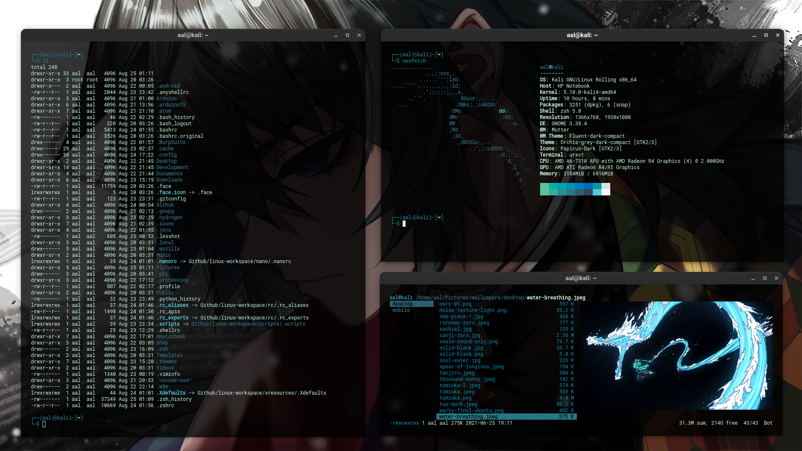
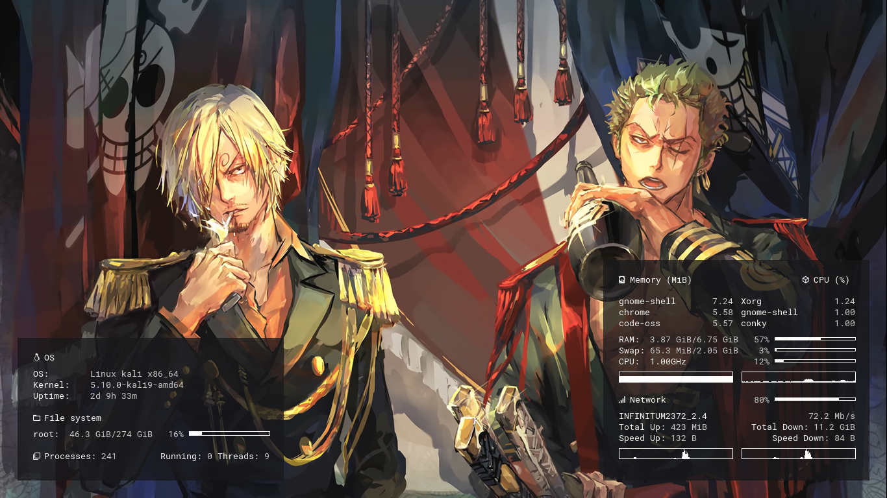

# Linux workspace (debian based distros - 2021)
This is the greatest management of all time.
## Screenshots
|Info|Preview|
|:-|:-|
|Desktop||
|Conky||
## Notes
_home/.homemade_ directory for my custom resources/projects
## Setup
```bash
sudo apt update;
sudo apt upgrade -y;
sudo apt install git stow;

mkdir Github; cd Github;
git clone https://github.com/AguilarLagunasArturo/linux-workspace.git;
cd linux-workspace;
# rm README.md; TODO: test and resolve conflicts

stow -Svt ~ *;
```
## List of content
- scripts
- shortcuts
- tutorials

# System configuration
Optional system configurations (*manual*).
## Shortcuts
|Name|Shortcut|Command|
|:-|:-|:-|
|US Keyboard layout|Super + Ctrl + U|`setxkbmap us`|
|ES Keyboard layout|Super + Ctrl + E|`setxkbmap es`|
|Launch rofi window|Super + Tab|`rofi -show window -theme $HOME/.config/rofi/themes/main.rasi`|
|Launch rofi applet|Super + A|`rofi -show drun -theme $HOME/.config/rofi/themes/main.rasi`|
|Launch terminal|Ctrl + Alt + T|`gnome-terminal`|
## Tutorials
### Stow commands
```bash
stow --adopt --nvt ~ <stow-folder>; # Adds new config files to stow directory
stow --nSvt ~ <stow-folder>;        # Symlink config files to $HOME directory
stow --nDvt ~ <stow-folder>;        # Removes symlinks from $HOME directory
```
### Read manpages
```bash
man -P "less -p 'CONFIGURATION SETTINGS'" <program-name>
```
### Load Xresources
```bash
xrdb ~/.Xresources
```
### Change default terminal emulator
```bash
sudo update-alternatives --config x-terminal-emulator
```
### Install language support
```bash
sudo nano /etc/locale.gen;  # Uncomment lines
sudo locale-gen;            # Install uncommented languages
```
### Install snap
```bash
sudo apt update;
sudo apt install -y snapd;
sudo systemctl enable --now snapd apparmor;
```
### Cache Github credentials
```bash
git config --global credential.helper 'cache --timeout 1200'
```
### Chage sound effects
```bash
# TODO
```
### Create custom menus
```bash
# TODO
```
### Change main terminal emulator
```bash
# TODO
```
### Change grub screen
```bash
# TODO
```
### Test utilities
- bat
- gdu
- tmux
- urxvt