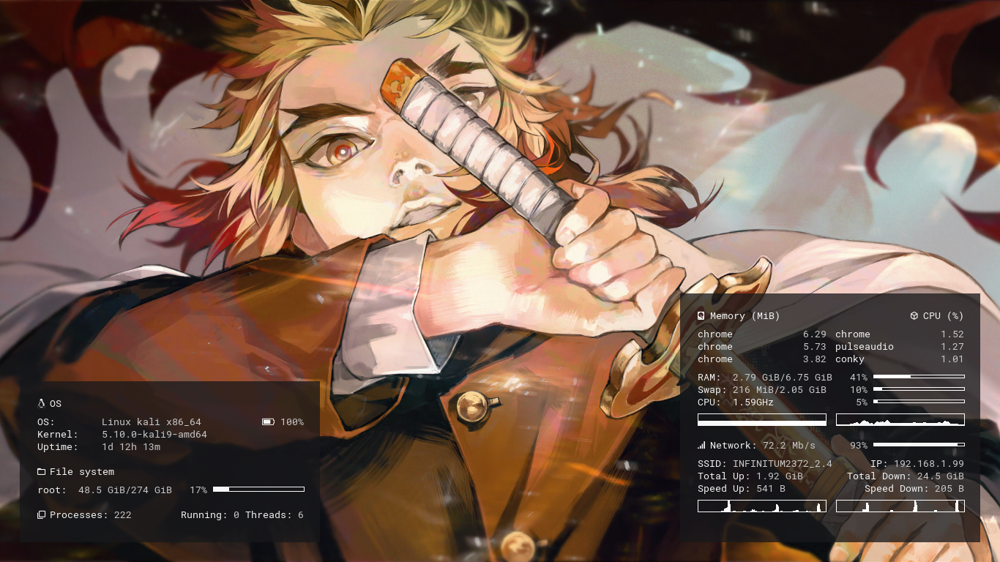

# Linux workspace (debian based distros - 2021)
This is the greatest management of all time.
## Screenshots
|Preview|
|:-|
||
||
## Notes
_home/.homemade_ directory for my custom resources/projects
## Setup
```bash
# Update and install dependencies
sudo apt update
sudo apt upgrade -y
sudo apt install git stow

# Clone repo
mkdir Github
cd Github
git clone https://github.com/AguilarLagunasArturo/linux-workspace.git

# Change directory and remove files
cd linux-workspace
rm README.md

# Create symlinks in the system
stow -Svt ~ *
git fetch
```
# System configuration
Stuff I have to configure manually.
## Shortcuts
|Name|Shortcut|Command|
|:-|:-|:-|
|US Keyboard layout|Super + Ctrl + U|`setxkbmap us`|
|ES Keyboard layout|Super + Ctrl + E|`setxkbmap es`|
|Reset conky|Super + Ctrl + C|`$HOME/.config/conky/./launch.sh`|
|Kill process|Super + Ctrl + X|`xkill`|
|Launch rofi window|Super + Tab|`rofi -show window -theme $HOME/.config/rofi/themes/main.rasi`|
|Launch rofi applet|Super + A|`rofi -show drun -theme $HOME/.config/rofi/themes/main.rasi`|
|Launch terminal|Ctrl + Alt + T|`kitty`|
## Tutorials
### Usefull stow commands
```bash
stow --adopt --nvt ~ <stow-folder> # Adds new config files to stow directory
stow --nSvt ~ <stow-folder>        # Symlink config files to $HOME directory
stow --nDvt ~ <stow-folder>        # Removes symlinks from $HOME directory
```
### Read manpages
```bash
# Case: 0
man <program-name>
# Case: 1
man -P "less -p 'CONFIGURATION SETTINGS'" <program-name>
```
### Load Xresources
```bash
xrdb ~/.Xresources
```
### Change default terminal emulator
```bash
sudo update-alternatives --config x-terminal-emulator
```
### ImageMagick allow Image to PDF
```bash
sudo nano /etc/ImageMagick-6/policy.xml
```
```xml
  <!-- disable ghostscript format types -->
  <policy domain="coder" rights="none" pattern="PS" />
  <policy domain="coder" rights="none" pattern="EPS" />
  <policy domain="coder" rights="none" pattern="PDF" /> <!-- CHANGE THIS -->
  <policy domain="coder" rights="none" pattern="XPS" />
```
```xml
  <policy domain="coder" rights="read | write" pattern="PDF" /> <!-- TO THIS -->
```

### Install language support
```bash
sudo nano /etc/locale.gen  # Uncomment lines
sudo locale-gen            # Install uncommented languages
```
### Install snap
```bash
sudo apt update
sudo apt install -y snapd
sudo systemctl enable --now snapd apparmor
```
### Cache Github credentials
```bash
git config --global credential.helper 'cache --timeout 1200'
```
### Create custom menus
```bash
# TODO
```
### Change grub screen
```bash
# TODO
```
### Test utilities
- bat
- gdu
### TODO
- test setup
